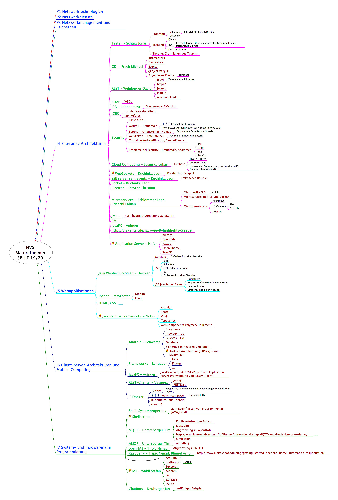
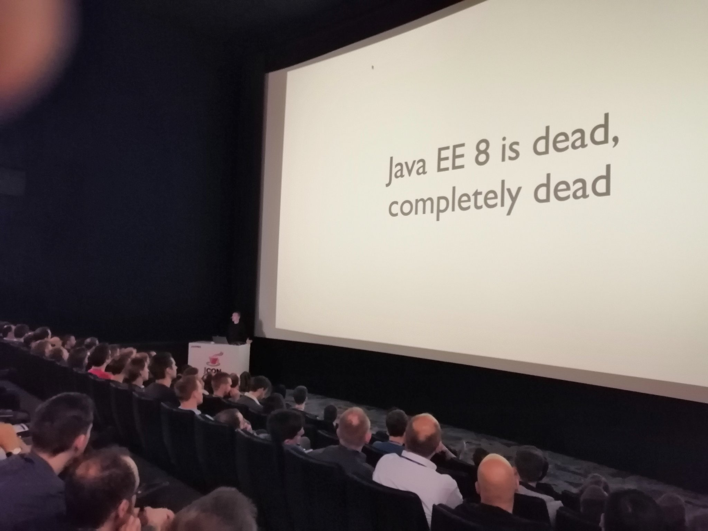

# Maturavorbereitung der 5bhif,2019/20 für NVS-Java

## Referate

## Literaturverweise

### Allgemein

- [Java aktuell - Zeitschrift mit interessanten Artikeln](https://www.ijug.eu/de/java-aktuell)
- [Automation Step by Step - AUTOMATION | TESTING | DEVOPS | CI](https://automationstepbystep.com/)

### Jakarta EE

- [JakartaONE: Live Coding with Jakarta EE and MicroProfile](http://www.adam-bien.com/roller/abien/entry/jakartaone_live_coding_with_jakarta)

### Security

- JWT (JSON Web Token)
  - [#WHATIS?: Eclipse MicroProfile JWT Auth](https://rieckpil.de/whatis-eclipse-microprofile-jwt-auth/)
  - [Securing JAX-RS Endpoints with JWT](https://dzone.com/articles/securing-jax-rs-endpoints-withnbspjwt)
  - [Tutorial: Create and Verify JWTs in Java](https://developer.okta.com/blog/2018/10/31/jwts-with-java)
- Keycloak
  - [Keycloak Quickstarts](https://github.com/keycloak/keycloak-quickstarts#keycloak)

  
### Testen

- [Philipp Hauer's Blog](https://phauer.com/2019/modern-best-practices-testing-java/)

### Quarkus

- [Quarkus: Supersonic, subatomic Java | DevNation Live](https://www.youtube.com/watch?v=7G_r1iyrn2c)
- [Tutorials for WildFly Application Server, Openshift, ...](http://www.mastertheboss.com/soa-cloud/quarkus/getting-started-with-quarkus)
- [Redhat Quarkus Tutorials](https://redhat-developer-demos.github.io/quarkus-tutorial/quarkus-tutorial/0.21.2/index.html)
- [Configuring A Quarkus Application](https://antoniogoncalves.org/2019/06/07/configuring-a-quarkus-application/)
- [Quarkus Cheat Sheet](https://lordofthejars.github.io/quarkus-cheat-sheet/#_what_is_quarkus)
- [Adam Bien: quarkus.io as ThinJAR on docker](https://www.youtube.com/watch?v=JSSoGaspoKE)
- [Quarkus Maven Plugin](https://mvnrepository.com/artifact/io.quarkus/quarkus-maven-plugin)

### JavaFX

- [Getting Started with JavaFX 13](https://openjfx.io/openjfx-docs/#maven)

### Android 

- [Android Codelabs](https://codelabs.developers.google.com/?cat=Android)

